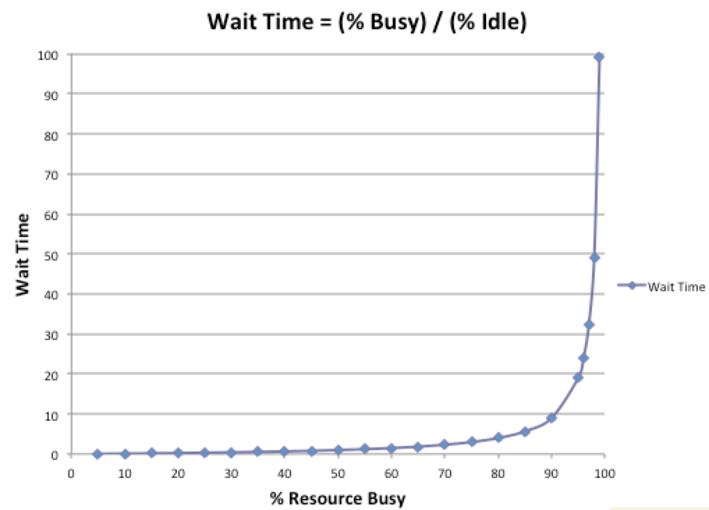
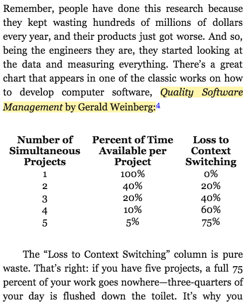

# Intro
## Me
- Tom Norris &lt;tom.norris@acquia.com&gt; github.com/tnorris
- Acquian for almost 3 years.
- About half my tenure on Operations, most recent half has been on Infrastructure Services Tools Team
- Did ITOps at `job.last`
- Did Managed IT at `jobs[-2]`
- First Distro: AMD K6-2 running Slackware 4
- Current Distro: 
    - Intel i5 running OSX
    - 1-5 AWS instances per service running Amazon Linux for ~~ handfuls of internal services
    - 17,000+ (growing every day) AWS instances running Ubuntu 14.04, for customer applications

## DevOps is How To
- Avoid stepping on each other's toes
- Speed up cycle times
- Continuously improve work life
- Use data to make decisions (win arguments)

Big focus on automation

## Kanban, Scrum, SRE, Oh My
- Kanban: a planning system, works great for fire-fighter type teams, thanks Toyota
- Scrum: another planning system, works great for development type team, thanks Jeff Sutherland
- SRE: site reliability engineer(ing), what happens when Google makes DevOps flavored KoolAid. Embedded sysadmin (SRE) in a scrum team, thanks Google

# Why Do You Want DevOps
## Management:
- The Industry's Best Standard.
- Increase throughput while reducing the inventory and operating expense (The Goal!) (reduce COGS)
- Slash time for ticket/incident resolution; with enough investment, this can be _orders_ of magnitude.
- Faster time to market
- Better availability of your company's APIs
- Happier employees

## Contributors:
- The Industry's Best Standard
- Automate away menial tasks that eat away at your soul
    - (we have multiple products with deployment runbooks that say, `get a snack`)
- Reduce total number of defects
- Ability to squish defects faster
- Reduction of duplicated effort!

# How Do we get there?
## Prereqs
- Ticketing System
- Monitoring
- Time Series Database

## The Three Ways
- How to incrementally adopt DevOps. Developed by Gene Kim et al

### Systems Thinking
- DevOps is not the goal. The goal is profit. DevOps is the way to get there.
- Map out all of the value streams that are enabled by your department. 
- Don't pass along defects (Have empathy for your clients)

### Amplify Feedback Loops
- Shorten feedback loops. Get cycle time down, get departments talking to each other
- Let the left hand know what the right hand is doing

### Culture of Continual Experimentation and Learning
- Root Cause Analysis
- Learn from your mistakes (go over your RCAs as a team)
- Improve your processes (make action items in your RCAs, prioritize them)
- Get rid of processes that don't make sense

## IT/Ops: Get Kanban in Place
- Talk to your Jira wizard, tell them you need a kanban project+board
- Get your customers to start using it (we'll talk about the prioritization meeting soon)
- NO JUMPING THE QUEUE! It's unfair to other stakeholders AND the business as a whole.

## Identifiy the Constraint
###  Metrics
#### Time Spent On Business projects
- Features for product
- adding a new customer-accessible version of PHP to the hosting platform
- creating a new spamfighting service
- getting PDF reports for clients

#### Time Spent On Internal Projects
These are things like...
- improving process
- making integration-tests faster
- cleaning up that ENGINEERING_ONBOARDING confluence page
- writing runbooks to deploy new TLS certificates to load balancers
- this talk
- Root Cause Analysis

#### Time Spent On Operational Change
- rack 'n stack
- putting servers up in a datacenter
- running scripts to spin up cloud primitives
- every time you type `puppet agent -t` or `ansible-playbook`
- rsyncing your `.war` files and HUPping tomcat
- giving JIRA more heap

#### Time Spent On Toil
- Waste and firefighting
- service is down
- server is on fire
- lightning storm took out us-east-1, please migrate fleet to us-west-2
- configuration typo by amazon engineer took out s3 on us-east-1, please migrate universe to us-west-2
- cutely named exploit of the month (time to reboot the fleet!)

### Dev Team (ideal world)
- Business, Internal, Change, Toil
Product wants you to keep making new features, but tech. debt still needs to get paid. You don't spend much time to deploy (See snack comment); you get paged once in a while (rotation)

### Ops Team (ideal world)
- Internal, Business, Change, Toil
Hacking on new projects to improve the business, like better monitoring, automating incident response. Teams want new hardware, but there's process and it's predictable. Firefighting is still a part of life, but normal work continues, even when the next rebootarama happens

### Cycle time
How long do I have to wait for a class of work to get gone?

### Throughput
Amount of work done. Storypoints/issues/new-customers-onboarded/etc

### Frequency by request type
This is how you know what to automate first

### Frequency by root cause
Use this to figure out what product defect is causing the most pain

### Downstream defects (Reopened Issues, Bugs)
Use this to figure out when you're stepping on other teams' (or even worse: customers') toes

### Time tracking (IT/Ops: average 5-6hours/day, SRE (site reliability engineer (meta devops)): track all time on toil, Dev: sprints)
#### For Ops/IT,
- people gotta eat, meet, get interrupted by folks asking, 'hey did you get my email about the thing?', use the restroom, deal with landlord
- less than that, and you can't really trust your metrics
- more than that, people are going to burn out
- If &gt; 25% of your IT or Ops teams are firefighting at the same time, at any given time, something is horribly wrong (paraphrased Tom Limoncelli)

#### For SRE:
- If more than half your time is on firefighting, pull in your dev team, they get to help!

#### For Dev:
- Have some sprint buffer to deal with bugs and other critical things that pop up during your sprints
- Acquia Infra. Services Tools Team does 20%
- This will make your embedded SRE, Ops Team, or IT Team much happier with your team

### Operational Load is the batting average of IT metrics
- Amount of time you spend keeping your boat afloat
- Google says cap it at 50%
- 

## Put A Limit On Work-in-progress To Reduce Operational Load
- Need buy-in from stakeholders (or their bosses)
- You are bad at multitasking. Even if you're good at multitasking, it's still overhead.
- 
- We found the a good cap to be `2*team_members`
    - Usually turns into one ticket you're actively working on, and one you're babysitting
 
## Benefits of limiting WIP
- more consistent work
- fewer errors due to scatterbrain

## A Note On Talking To Business Folks
- Dollars per second is the most effective metric.
- You can use unit conversions to get from operational load to dollars/second.
- Dollars per quarter is the 2nd most effective.

## How to limit WIP without being lit on fire by other departments
- Set up a prioritization meeting
- Force stakeholders to show up to this meeting with tickets they need completed
- Tell them how many tickets your team can get done today
- Make them figure out what's most important to the business today
- This gets rid of un-needed work, as stakeholders answer, "is this ticket ACTUALLY important for the business?", and find work that isn't

## You're Actually Still Going To Be Lit On Fire
- "You can only do FIVE tickets today!?" (a lot of people are on vacation last week of the year)
- "You can't do ANY tickets today!?" ('rebootarama' style hosting-release)

# Track Metrics On A Highly Visible Dashboard
- Raspberry PI is a few dollars
- TVs are getting pretty cheap
- Old low-res LCDs are also pretty cheap! Perfect for graphs!
- Put this LCD in a highly visible space.
    - Acquia has many screens above 'ops row', and a 'vitals' dashboard near cloud-engineering
    - Amin has St. Amin's Fire

# Document Common Processes
Once your team gets into the habbit of using runbooks (and continuously improving them as things change),
- tasks become accessible to the entire team
- you get escalated to less often, because you can point to the docs (and say READ THE DOCS)
- tasks become consistent, which will help your team lead predict the future; you'll be able to tell your stakeholders how much work will get done today

Write runbooks for the most frequently occuring task, first. Use `/[:alpha:]*scouts/` camping rules, and Kaizen/3rd-way, when you stub your toe, fix the runbook!

# Automate Common Processes
- You *must* have runbooks before you automate.
- This usually starts off as bash-in-a-for-loop, then moves to something like puppet/ansible, then a task system, then maybe a workflow system

# Throw Out Processes That Don't Make Any Sense
- If you're a two person team, and commit policy says you need 3 reviews from people on your team, time to revisit the commit policy
- Ops had an Ops Severity field in Jira. Jira has a "Severity" field that encodes the exact same information. Time to port Ops Severity -> Severity

# Streamline ticket creation
Turns out you can get fancy with JIRA tickets, requiring things like 

- Component
- Severity
- Hosting Environment
- Customer Impact
- Customer Deadline

or for a Sprint team

- Epic
- Sprint
- Stakeholder
- Release notes required?
- (don't forget to click 'move to kanban!')

People are pretty bad at remembering all these things.
Streamline the process by making a portal to your ticketing system.
Start off with the most frequent tasks, that way you get

- consistent tickets
- reduced back-and-forth ("you didn't mark it as critical so we didn't realize the customer needs it today!")
- reduced time-to-completion (due to the above)

You don't have to go crazy and build a service here (but you totally can). A PoC can be done in Confluence by creating chose-your-own-adventure links to confluence pages that eventually link to Jira's `createTicket?with=url&params=to&set=your&custom=fields`

# Do Root Cause Analysis
- You're not doing this to throw folks under the bus, you're doing it to shine a light on broken/wrong/obsolete/incomplete process
- Don't throw folks under the bus, you're all on the same team; best case, you ruin a commute
- Summary (3 sentences is a long one)
- Customer Impact
- Timeline
- What went well
- What went lucky
- What went poorly
- Corrective Actions (in the form of Jira tickets)
    - Short term: this sprint (next couple weeks)
    - Medium term: this quarter
    - Long term: maybe someday!
    
# Share RCAs With The Company
- Each Support/Ops/Eng team at Acquia has a confluence page with a title like "RCA Archive" with all of their RCAs
- These are typically internal only; customer facing ones have to go through legal
- We have a weekly meeting called L3 (lunch + lessons learned) to go over them

# Configuration Management Is Empowering
- Gold Standard: Akamai
    - They can tell you everything about the hardware AND software on every node in the Akamai CDN
    - Not only for right now (That's easy), but historically (whaaat?!)
- For Linux: Find something like puppet or chef or ansible or salt
- For Windows: Not super experienced here, heard OK things about puppet

## Servers as Code
- Steal good ideas from programmers
- You can run diff on codebases
- 'Hey man, can you test my new nagios configuration changes before I push them out to the servers?'
- Tools exist to automagically enforce policies
    - tabs vs spaces (make, anyone?)
    - ensure this change work in both Xenial and Precise
    - ensure this change work in both Ubuntu and Totally Not Centos (Amazon Linux)
    - ensure newhire SSH keys have keylengths of &gt;= 4096

## Going From Pets To Cattle
- Make your puppetmaster/chefserver your first cattle
    - Use puppet/chef to provision puppet/chef, that way if your puppet/chef server goes down, no big, autoscaling saves the day
- Use EBS backed instances for your pets
- Encode your pet configuration into puppet (this turns them into cylon (regeneratable) pets)
- Chop off a head of the hydra (API), port it to an architecture that supports cattle
- When Amazon says "Use Multi Region" you should really use Multi Region
- There are tools to get VMDKs into AMIs, but I have near zero experience with them
- Write abstractions for metadata gathering
    - puppet/chef/etc shouldn't care if it's configuring an AWS instance or if it's on a VMWare guest. 

# Resources!
## Books
- The Phoenix Project
- The Practice of Cloud System Administration
- Scrum: The Art of Doing Twice the Work in Half the Time
- Site Reliability Engineering

## Meetups
- https://www.meetup.com/Boston-Devops/

## Talks
- Amin Astaneh - People Metrics: https://www.youtube.com/watch?v=sWMy6aNY_XA
